# บทที่ 3
# วิธีการดำเนินงาน

การวิเคราะห์และออกแบบระบบบันทึกรายได้และคำนวณค่าคอมมิชชันช่างตัดผมแบบเรียลไทม์ผ่านแอปพลิเคชันไลน์ ได้ดำเนินการตามกระบวนการพัฒนาระบบสารสนเทศอย่างเป็นขั้นตอน เพื่อให้ระบบมีความสมบูรณ์ รองรับการบริหารจัดการทั้งในส่วนของเงินเข้า (Incomes) และเงินออกในการตัดรอบเคลียร์เงินค่าคอมมิชชันให้แก่ช่างตัดผม (Barber Payout / Settlement) พร้อมการจัดการฐานข้อมูลแบบซีอาร์ยูดี (CRUD Operations) โดยมีรายละเอียดดังต่อไปนี้

## 3.1 การศึกษาเบื้องต้น
จากการศึกษาข้อมูลเบื้องต้นเกี่ยวกับกระบวนการทำงานและการบริหารจัดการของธุรกิจร้านตัดผม พบว่า:
### 3.1.1 ระบบงานเดิมและการวิเคราะห์ปัญหาด้วยแผนภูมิก้างปลา (Fishbone Diagram)
จากการศึกษาและวิเคราะห์กระบวนการทำงานของร้านตัดผมในปัจจุบัน พบว่าการรับชำระเงินมีทั้งรูปแบบเงินสดและการโอนเงินผ่านระบบธนาคาร เมื่อลูกค้าโอนเงิน เจ้าของร้านหรือช่างตัดผมต้องคอยสลับหน้าจอเพื่อเปิดแอปพลิเคชันธนาคารตรวจสอบยอดเงิน ซึ่งก่อให้เกิดความล่าช้า ข้อมูลตกหล่น และมีความเสี่ยงต่อการถูกหลอกลวงด้วยสลิปปลอมแปลงหรือการนำสลิปเก่ามาวนใช้ซ้ำ นอกจากนี้ การคำนวณส่วนแบ่งค่าคอมมิชชันของช่างตัดผมยังอาศัยการจดบันทึกลงสมุดบัญชีด้วยมือ ทำให้เกิดความผิดพลาดในการคำนวณ เสียเวลาอย่างมากในการตัดรอบเคลียร์เงิน และช่างตัดผมไม่สามารถตรวจสอบยอดรายได้สะสมของตนเองได้แบบเรียลไทม์

ผู้จัดทำจึงได้ทำการวิเคราะห์สาเหตุของปัญหาในระบบงานเดิมอย่างเป็นระบบด้วย **แผนภูมิก้างปลา (Fishbone Diagram หรือ Ishikawa Diagram)** โดยจำแนกปัจจัยต้นตอของปัญหาออกเป็น 4 ด้านหลัก ดังนี้:

1. **ด้านบุคลากร (People):**
   - เจ้าของร้าน: ต้องเสียเวลาตรวจสอบยอดเงินและสลิปด้วยสายตา และต้องจดจำอัตราส่วนแบ่งคอมมิชชันของช่างแต่ละคน
   - ช่างตัดผม: ไม่ทราบยอดรายได้สะสมแบบเรียลไทม์ ตรวจสอบความถูกต้องของส่วนแบ่งย้อนหลังได้ยาก ส่งผลต่อความโปร่งใสและความเชื่อมั่น
2. **ด้านกระบวนการทำงาน (Process):**
   - กระบวนการรับชำระเงิน: ต้องสลับหน้าจอแอปพลิเคชันไปมาทำให้การบริการสะดุดและล่าช้า
   - การคิดส่วนแบ่งคอมมิชชัน: ใช้การคัดลอกและคำนวณด้วยมือ มีโอกาสตกหล่นและคำนวณผิดพลาด
   - การตัดรอบเคลียร์เงิน: ใช้เวลาสรุปยอดนานในแต่ละงวด และไม่มีขั้นตอนการทำโมฆะบิล (Void Bill) ที่เป็นมาตรฐานพร้อมหลักฐานตรวจสอบ
3. **ด้านเทคโนโลยีและเครื่องมือ (Technology):**
   - ขาดระบบตรวจสอบสลิปและคิวอาร์โค้ดอัตโนมัติ (Automated Slip Verification API)
   - ระบบการทำงานแยกส่วนกัน (System Silos): แอปธนาคาร แอปแชท และสมุดบัญชีไม่ได้เชื่อมโยงกัน
   - ขาดระบบเวิร์กโฟลว์อัตโนมัติ (Workflow Automation) และไม่มีระบบออกใบเสร็จอิเล็กทรอนิกส์ (e-Receipt) ตอบกลับลูกค้าทันที
4. **ด้านข้อมูลและการตรวจสอบ (Data & Security):**
   - ข้อมูลธุรกรรมกระจัดกระจาย บันทึกลงกระดาษหรือสมุดเสี่ยงต่อการชำรุดสูญหาย
   - ความเสี่ยงสูงต่อการทุจริตจากสลิปปลอมแปลงและสลิปวนใช้ซ้ำ (Duplicate Slip)
   - ขาดระบบบันทึกประวัติการทำรายการ (Audit Trail) และไม่มีแดชบอร์ดสรุปผลประกอบการแบบเรียลไทม์เพื่อการตัดสินใจเชิงธุรกิจ

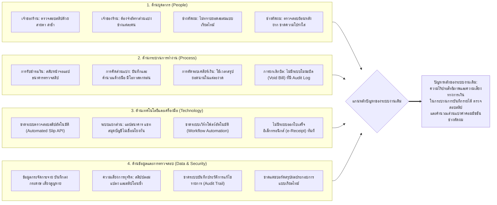

<b>ภาพที่ 3.1 แผนภูมิก้างปลาแสดงการวิเคราะห์สาเหตุของปัญหาในระบบงานเดิม (Fishbone Diagram)</b> ที่มา : ผู้จัดทำโครงงาน

### 3.1.2 ระบบงานใหม่ 
ระบบใหม่ถูกพัฒนาขึ้นเพื่อบริหารจัดการร้านตัดผมอย่างครบวงจร โดยแบ่งการทำงานออกเป็น:
1. **ฝั่งบริการหน้าร้านและลูกค้า (เงินเข้า):** ให้บริการผ่านแอปพลิเคชันไลน์ โดยลูกค้าสามารถเลือกช่างตัดผม เลือกบริการ และอัปโหลดสลิปโอนเงินผ่านหน้าเว็บลิฟต์ (LINE LIFF) ข้อมูลสลิปจะถูกส่งไปตรวจสอบความถูกต้องและยอดเงินจริงกับสลิปทูโกเอพีไอ (Slip2Go API) โดยอัตโนมัติ พร้อมส่งใบเสร็จรับเงินอิเล็กทรอนิกส์ (e-Receipt) ตอบกลับไปยังลูกค้า ช่าง และเจ้าของร้านทันที
2. **ฝั่งการจัดการร้านและเคลียร์เงินหลังบ้าน (Admin Web Backoffice - เงินออก):** เจ้าของร้านสามารถเข้าใช้งานระบบจัดการข้อมูลแบบ CRUD ได้อย่างเต็มรูปแบบ ทั้งการจัดการข้อมูลช่างตัดผม รายการบริการ การทำโมฆะบิล (Void Bill) และการตัดรอบเคลียร์เงินส่วนแบ่งค่าคอมมิชชันให้ช่างตัดผม (Settlement & Payout) พร้อมแนบสลิปหลักฐานการจ่ายเงิน
3. **ฝั่งการวิเคราะห์และสรุปผล:** เชื่อมโยงข้อมูลจากมายเอสคิวแอล (MySQL) เข้ากับลุกเกอร์สตูดิโอ (Looker Studio) เพื่อแสดงผลสรุปรายรับรวม ยอดจ่ายเคลียร์ให้ช่าง และรายได้สุทธิแบบเรียลไทม์

## 3.2 การกำหนดความต้องการของระบบ
การกำหนดความต้องการของระบบ มีรายละเอียดดังต่อไปนี้:
### 3.2.1 ขอบเขตของระบบ
3.2.1.1 การเลือกรหัสช่าง, เลือกบริการ, อัปโหลดสลิป, ตรวจสอบสลิปอัตโนมัติ และรับใบเสร็จรับเงินผ่านแอปพลิเคชันไลน์  
3.2.1.2 การตัดรอบคำนวณและบันทึกประวัติการจ่ายค่าคอมมิชชันให้แก่ช่างตัดผม (Settlement / Payout) พร้อมแนบสลิปหลักฐาน  
3.2.1.3 การจัดการข้อมูลแบบครบวงจร (CRUD) สำหรับข้อมูลผู้ใช้ ช่าง บริการ รายรับ และการเคลียร์ยอดเงิน  
3.2.1.4 การออกรายงานและแสดงผลแดชบอร์ดสรุปรายรับ ยอดจ่ายช่าง และรายได้สุทธิบนลุกเกอร์สตูดิโอ  

### 3.2.2 ฮาร์ดแวร์ที่ใช้กับระบบงาน
ประกอบด้วยระบบคลาวด์ของเรลเวย์ (Railway Cloud Hosting) ซึ่งทำหน้าที่เป็นโครงสร้างพื้นฐานในการรันเอ็นเอทเอ็น ฐานข้อมูลมายเอสคิวแอล และโฮสต์ระบบเว็บแอปพลิเคชัน และเครื่องคอมพิวเตอร์ส่วนบุคคลโน้ตบุ๊ก HP VICTUS 16 (i5-12500H) สำหรับพัฒนาและทดสอบระบบ โดยผู้ใช้งานสามารถเข้าถึงระบบผ่านสมาร์ตโฟน VIVO V27 5G ที่ติดตั้งแอปพลิเคชันไลน์

### 3.2.3 ซอฟต์แวร์ใช้กับระบบงาน
ประกอบด้วยเอ็นเอทเอ็น (n8n) บนเรลเวย์สำหรับประมวลผลเวิร์กโฟลว์อัตโนมัติ, สลิปทูโกเอพีไอ (Slip2Go API) สำหรับตรวจสอบสลิป, ฐานข้อมูลมายเอสคิวแอล (MySQL), ไลน์ ฟรอนต์เอนด์ เฟรมเวิร์ก (LIFF), ไลน์เมสเสจจิ้งเอพีไอ (LINE Messaging API), เว็บแอปพลิเคชันจัดการหลังบ้าน (Admin Web Backoffice) พัฒนาด้วย HTML/CSS/JavaScript และลุกเกอร์สตูดิโอ (Looker Studio) สำหรับวิเคราะห์รายงานผลทางการเงิน

## 3.3 การออกแบบระบบ
การออกแบบระบบประกอบไปด้วยการออกแบบสถาปัตยกรรมการทำงาน แผนภาพลำดับขั้นตอน การออกแบบฐานข้อมูล และการออกแบบส่วนติดต่อผู้ใช้งาน ดังต่อไปนี้

### 3.3.1 การออกแบบระบบ (System Architecture)

*(แทรกรูปภาพที่ 3.1 ภาพรวมการทำงานของระบบ ตรงนี้)*

**ภาพที่ 3.1** ภาพรวมการทำงานของระบบบันทึกรายได้และคำนวณค่าคอมมิชชันช่างตัดผมแบบเรียลไทม์  
**ที่มา:** โดยผู้จัดทำโครงงาน  

ก) ลูกค้ากดปุ่มแจ้งชำระเงินผ่านแอปพลิเคชันไลน์ เพื่อเปิดหน้าเว็บแอปพลิเคชันผ่านระบบลิฟต์ (LIFF)  
ข) หน้าเว็บลิฟต์ส่งข้อมูลบริการ รหัสช่าง และภาพสลิปโอนเงินผ่านเว็บฮุก (Webhook) ไปยังเอ็นเอทเอ็น (n8n) บนเรลเวย์  
ค) เอ็นเอทเอ็นเรียกใช้สลิปทูโกเอพีไอ (Slip2Go API) เพื่อตรวจสอบความถูกต้องของสลิปโอนเงินและดึงยอดเงินจริง  
ง) สลิปทูโกส่งผลลัพธ์การตรวจสอบและรายละเอียดยอดเงินกลับมายังเอ็นเอทเอ็น  
จ) เอ็นเอทเอ็นทำการคำนวณค่าคอมมิชชันของช่าง และบันทึกข้อมูลธุรกรรมลงในตารางประวัติธุรกรรม (transactions) ในฐานข้อมูลมายเอสคิวแอล  
ฉ) เอ็นเอทเอ็นเรียกใช้ไลน์เมสเสจจิ้งเอพีไอ เพื่อส่งใบเสร็จรับเงินอิเล็กทรอนิกส์ (e-Receipt) ตอบกลับไปยังลูกค้า และส่งข้อความแจ้งเตือนยอดเงินไปยังช่างตัดผม  
ช) เจ้าของร้านเข้าสู่ระบบเว็บแอดมินหลังบ้าน (Admin Web Backoffice) เพื่อตรวจสอบบิล จัดการข้อมูลแบบ CRUD และทำการตัดรอบเคลียร์เงินส่วนแบ่งค่าคอมมิชชันให้ช่าง (payouts)  
ซ) ข้อมูลรายรับและประวัติการเคลียร์ยอดเงินทั้งหมดจะถูกซิงค์ไปยังลุกเกอร์สตูดิโอ (Looker Studio) เพื่อประมวลผลเป็นแดชบอร์ดสรุปผลทางการเงินแบบเรียลไทม์  

#### 3.3.1.1 แผนภาพลำดับ (Sequence Diagram) ลูกค้าเปิดหน้าเว็บลิฟต์ (LIFF)

*(แทรกรูปภาพที่ 3.2 แผนภาพลำดับการเปิดหน้าเว็บลิฟต์ ตรงนี้)*

**ภาพที่ 3.2** แผนภาพลำดับการเปิดหน้าเว็บเพื่อแจ้งชำระเงิน (LIFF)  
**ที่มา:** โดยผู้จัดทำโครงงาน  

ก) ลูกค้ากดปุ่ม แจ้งชำระเงิน จากริชเมนูบนไลน์ เพื่อเปิดหน้าเว็บลิฟต์  
ข) หน้าเว็บลิฟต์ส่งคำสั่งขอข้อมูลช่างตัดผมไปยังเอ็นเอทเอ็นเว็บฮุก  
ค) เอ็นเอทเอ็นเรียกใช้คำสั่งคิวรีไปยังฐานข้อมูลมายเอสคิวแอลเพื่อดึงรายชื่อช่าง  
ง) ฐานข้อมูลมายเอสคิวแอลส่งข้อมูลรายชื่อช่างตัดผมกลับมายังเอ็นเอทเอ็น  
จ) เอ็นเอทเอ็นส่งข้อมูลช่างตัดผมในรูปแบบเจซัน (JSON) กลับไปยังหน้าเว็บลิฟต์  
ฉ) หน้าเว็บลิฟต์ส่งคำสั่งขอข้อมูลรายการบริการและราคาไปยังเอ็นเอทเอ็นเว็บฮุก  
ช) เอ็นเอทเอ็นเรียกใช้คำสั่งคิวรีเพื่อดึงข้อมูลบริการจากมายเอสคิวแอล  
ซ) ฐานข้อมูลมายเอสคิวแอลส่งข้อมูลบริการและราคากลับมายังเอ็นเอทเอ็น  
ฌ) เอ็นเอทเอ็นส่งข้อมูลบริการในรูปแบบเจซันกลับไปยังหน้าเว็บลิฟต์  
ญ) หน้าเว็บลิฟต์นำข้อมูลช่างและบริการมาแสดงผลบนฟอร์มให้ลูกค้าเลือกทำรายการ  

#### 3.3.1.2 แผนภาพลำดับ (Sequence Diagram) การตรวจสอบสลิปและชำระเงิน

**ภาพที่ 3.3** แผนภาพลำดับ (Sequence Diagram) การตรวจสอบสลิปและชำระเงิน  
**ที่มา:** โดยผู้จัดทำโครงงาน  

จากภาพที่ 3.3 อธิบายขั้นตอนการตรวจสอบสลิปและบันทึกชำระเงิน ดังนี้:
- **ก)** ลูกค้าเลือกรหัสช่าง บริการ และแนบรูปสลิปโอนเงินธนาคาร จากนั้นกดส่งข้อมูล  
- **ข)** หน้าเว็บลิฟต์ส่งข้อมูลทั้งหมดผ่านคำขอ HTTP POST ไปยังเอ็นเอทเอ็น (`/webhook/api/checkout`)  
- **ค)** เอ็นเอทเอ็นแปลงรูปสลิปเป็น Base64 แล้วส่งไปตรวจสอบกับสลิปทูโกเอพีไอ (Slip2Go API)  
- **ง)** สลิปทูโกเอพีไอตรวจสอบคิวอาร์โค้ดและส่งผลการตรวจสอบกลับมา ได้แก่ รหัสสถานะ (`code: 200000`), เลขอ้างอิงธุรกรรม (`transRef`), ชื่อบัญชีผู้รับโอนเงิน และยอดเงินจริง  
- **จ)** เอ็นเอทเอ็นตรวจสอบเงื่อนไขความถูกต้อง 3 ขั้นตอนหลัก:
  1. ตรวจสอบความถูกต้องของสลิปและยอดเงินต้องไม่น้อยกว่าราคาค่าบริการ (`Amount >= Base Price`)
  2. ตรวจสอบบัญชีผู้รับโอนเงิน ต้องเป็นบัญชีของทางร้าน คือ **"นาย สราวุฒิ อุทยาหาญ"** เท่านั้น หากโอนผิดบัญชีระบบจะปฏิเสธรายการทันที
  3. ตรวจสอบรหัสอ้างอิงสลิป (`trans_ref`) ในตาราง `transactions` ของฐานข้อมูลมายเอสคิวแอล เพื่อป้องกันการนำสลิปเดิมมาใช้ซ้ำ (Anti-Duplicate Check)
- **ฉ)** เมื่อผ่านการตรวจสอบครบถ้วน:
  1. คำนวณส่วนแบ่งค่าคอมมิชชันช่างตามสูตร: ยอดเงินจริง คูณ (เปอร์เซ็นต์ส่วนแบ่ง / 100)
  2. บันทึกธุรกรรมลงตาราง `transactions` โดยตั้งค่า `status = 'completed'` และ `payout_status = 'unsettled'`
  3. คิวรีดึงรหัสธุรกรรมจริงล่าสุด (เช่น `transaction_id = 39`) เพื่อสร้างรหัสใบเสร็จจริงในรูปแบบ **TXN-39**
  4. ส่งใบเสร็จรับเงินอิเล็กทรอนิกส์ e-Receipt (Flex Message) ที่มีรหัสบิลจริง ยอดเงิน และชื่อช่าง ตอบกลับไปยังลูกค้า
  5. ส่งข้อความ Push Notification แจ้งเตือนยอดรายได้และค่าคอมมิชชันไปยังไลน์ของช่างตัดผมทันที
- **ช)** กรณีไม่ผ่านเงื่อนไข (สลิปปลอม, โอนเข้าบัญชีอื่น, สลิปซ้ำ, หรือยอดเงินไม่ครบ): ระบบจะปฏิเสธรายการและส่งข้อความแจ้งเตือนให้ลูกค้าตรวจสอบและทำรายการใหม่อีกครั้ง  

#### 3.3.1.3 แผนภาพลำดับ (Sequence Diagram) การตัดรอบเคลียร์เงินและจ่ายค่าคอมมิชชันช่าง (Settlement / Payout)

**ภาพที่ 3.4** แผนภาพลำดับ (Sequence Diagram) การตัดรอบเคลียร์เงินและจ่ายค่าคอมมิชชันช่าง  
**ที่มา:** โดยผู้จัดทำโครงงาน  

จากภาพที่ 3.4 อธิบายกระบวนการตัดรอบเคลียร์เงินช่าง ดังนี้:
- **ก)** เจ้าของร้านเข้าสู่ระบบ Admin Backoffice ที่เมนูตัดรอบเคลียร์เงิน (Payouts)  
- **ข)** ระบบหลังบ้านส่งคำขอไปยังเอ็นเอทเอ็น เพื่อดึงยอดสะสมของบิลที่สถานะเป็น `unsettled`  
- **ค)** เอ็นเอทเอ็นรวมยอดค่าคอมมิชชันแยกตามรายช่างจากฐานข้อมูล และส่งกลับมาแสดงผลเป็นการ์ดสรุปยอดเงิน  
- **ง)** เจ้าของร้านทำรายการโอนเงินให้ช่าง และกดปุ่ม "ยืนยันโอนเงิน & แจ้งเตือนช่าง"  
- **จ)** เอ็นเอทเอ็นบันทึกประวัติการจ่ายลงในตาราง `payouts` และทำการอัปเดตสถานะบิลในตาราง `transactions` เป็น `settled`  
- **ฉ)** เอ็นเอทเอ็นส่งข้อความแจ้งเตือนพร้อมหลักฐานการโอนเงินเคลียร์ยอดไปยังไลน์ของช่างตัดผม  
- **ช)** ระบบแจ้งเตือนเจ้าของร้านว่าตัดรอบสำเร็จ และรีเซ็ตยอดค้างเคลียร์เป็น 0 บาท  

#### 3.3.1.4 แผนภาพลำดับ (Sequence Diagram) การทำโมฆะบิล (Void Bill)

**ภาพที่ 3.5** แผนภาพลำดับ (Sequence Diagram) การทำโมฆะบิล (Void Bill)  
**ที่มา:** โดยผู้จัดทำโครงงาน  

จากภาพที่ 3.5 อธิบายขั้นตอนการทำโมฆะบิล ดังนี้:
- **ก)** เจ้าของร้านเลือกบิลที่ต้องการยกเลิกจากตารางรายการ และกดปุ่ม "โมฆะบิล (Void)"  
- **ข)** ระบบแสดงกล่องข้อความยืนยันการยกเลิก เพื่อป้องกันความผิดพลาด  
- **ค)** เมื่อเจ้าของร้านกดยืนยัน ระบบจะส่งคำขอ POST ไปยังเอ็นเอทเอ็น (`/webhook/api/admin/void`)  
- **ง)** เอ็นเอทเอ็นอัปเดตสถานะของบิลในตาราง `transactions` เป็น `voided` และปรับค่าคอมมิชชันเป็น 0 บาท  
- **จ)** เอ็นเอทเอ็นส่ง Push Message แจ้งเตือนไปยังช่างตัดผมว่าบิลดังกล่าวถูกยกเลิกแล้ว และอัปเดตหน้าจอแอดมินทันที  

#### 3.3.1.5 ผังงานการตรวจสอบสลิปและตรรกะการประมวลผลธุรกรรม (Flowchart)

**ภาพที่ 3.6** ผังงานการตรวจสอบสลิปและประมวลผลธุรกรรม (Flowchart)  
**ที่มา:** โดยผู้จัดทำโครงงาน  

ผังงานในภาพที่ 3.6 แสดงการคัดกรองช่องทางการชำระเงิน:
1. หากเลือกชำระเงินสด (Cash): ระบบจะบันทึกธุรกรรมเป็นเงินสด และสร้างใบเสร็จรับเงินสดอิเล็กทรอนิกส์ (Cash e-Receipt) ให้แก่ลูกค้าพร้อมแจ้งเตือนช่างตัดผมทันที
2. หากเลือกชำระเงินโอน (Transfer): ระบบจะส่งรูปสลิปไปตรวจกับ Slip2Go API ตรวจจับสลิปปลอม ตรวจสอบบัญชีผู้รับเงิน **"นาย สราวุฒิ อุทยาหาญ"** ตรวจจับสลิปซ้ำ และตรวจยอดเงินครบถ้วนก่อนบันทึกข้อมูลและส่ง e-Receipt รหัสจริง `TXN-39`

#### 3.3.1.6 แผนภาพกระแสข้อมูลระดับ 0 (DFD Level 0 / Context Diagram)

.png)

**ภาพที่ 3.13** แผนภาพกระแสข้อมูลระดับ 0 (DFD Level 0 / Context Diagram)  
**ที่มา:** โดยผู้จัดทำโครงงาน  

#### 3.3.1.7 แผนภาพยูสเคส (UML Use Case Diagram)

**ภาพที่ 3.14** แผนภาพยูสเคส (UML Use Case Diagram with System Boundary)  
**ที่มา:** โดยผู้จัดทำโครงงาน  

### 3.3.2 การออกแบบฐานข้อมูล (Database Design)

#### 3.3.2.1 แผนภาพแสดงความสัมพันธ์ของข้อมูล (Entity-Relationship Diagram)

.png)

**ภาพที่ 3.7** แผนภาพแสดงความสัมพันธ์ของข้อมูล (ER-Diagram 4 ตารางหลัก)  
**ที่มา:** โดยผู้จัดทำโครงงาน  

#### 3.3.2.2 พจนานุกรมข้อมูล (Data Dictionary)
พจนานุกรมข้อมูล (Data Dictionary) คือ รายละเอียดคำอธิบายโครงสร้างตารางข้อมูลในระบบฐานข้อมูลมายเอสคิวแอล ซึ่งประกอบด้วย 4 ตารางหลัก ดังต่อไปนี้:

**ตารางที่ 3.1** ตารางจัดการข้อมูลผู้ใช้งานและช่างตัดผม (users)
| ลำดับ (No) | คุณสมบัติ (Attribute) | คำอธิบาย (Description) | ขนาด (Width) | ประเภท (Type) | ประเภทคีย์ (Key Type) |
| :---: | :--- | :--- | :---: | :---: | :---: |
| 1 | user_id | รหัสประจำตัวผู้ใช้งาน/ช่าง | - | INT | PK |
| 2 | line_uid | รหัสประจำตัวผู้ใช้บนไลน์ | 100 | VARCHAR | - |
| 3 | full_name | ชื่อ-นามสกุล หรือชื่อช่าง | 255 | VARCHAR | - |
| 4 | role | บทบาทหน้าที่ (owner/barber) | 50 | VARCHAR | - |
| 5 | commission_rate | อัตราส่วนแบ่งค่าคอมมิชชัน (%) | 5,2 | DECIMAL | - |
| 6 | is_active | สถานะการทำงาน (1=เปิด, 0=ปิด) | 1 | TINYINT | - |
| 7 | image_url | ที่อยู่ลิงก์รูปภาพโปรไฟล์ช่าง | 500 | VARCHAR | - |
| 8 | created_at | วันและเวลาที่ลงทะเบียน | - | TIMESTAMP | - |

**ตารางที่ 3.2** ตารางจัดการข้อมูลบริการ (services)
| ลำดับ (No) | คุณสมบัติ (Attribute) | คำอธิบาย (Description) | ขนาด (Width) | ประเภท (Type) | ประเภทคีย์ (Key Type) |
| :---: | :--- | :--- | :---: | :---: | :---: |
| 1 | service_id | รหัสประจำตัวบริการ | - | INT | PK |
| 2 | service_name | ชื่อประเภทบริการตัดผม | 255 | VARCHAR | - |
| 3 | base_price | ราคาค่าบริการมาตรฐาน | 10,2 | DECIMAL | - |
| 4 | image_url | ที่อยู่ลิงก์รูปภาพตัวอย่างบริการ | 500 | VARCHAR | - |
| 5 | is_active | สถานะการให้บริการ (1=เปิด, 0=ปิด) | 1 | TINYINT | - |
| 6 | created_at | วันและเวลาที่เพิ่มบริการ | - | TIMESTAMP | - |

**ตารางที่ 3.3** ตารางจัดการข้อมูลธุรกรรมและรายรับ (transactions)
| ลำดับ (No) | คุณสมบัติ (Attribute) | คำอธิบาย (Description) | ขนาด (Width) | ประเภท (Type) | ประเภทคีย์ (Key Type) |
| :---: | :--- | :--- | :---: | :---: | :---: |
| 1 | transaction_id | รหัสประจำตัวธุรกรรม/บิล | - | INT | PK |
| 2 | user_id | รหัสช่างผู้ให้บริการ | - | INT | FK |
| 3 | service_id | รหัสบริการที่ถูกเลือก | - | INT | FK |
| 4 | customer_uid | รหัสไลน์ของลูกค้าผู้รับบริการ | 100 | VARCHAR | - |
| 5 | payment_method | ช่องทางการชำระเงิน (transfer/cash) | 20 | VARCHAR | - |
| 6 | actual_price | ยอดเงินที่ชำระจริงจากสลิปหรือเงินสด | 10,2 | DECIMAL | - |
| 7 | commission_amount | ค่าคอมมิชชันที่คำนวณได้ | 10,2 | DECIMAL | - |
| 8 | trans_ref | รหัสอ้างอิงสลิปธนาคาร (ป้องกันสลิปซ้ำ) | 100 | VARCHAR | UNIQUE |
| 9 | slip_image_url | ที่อยู่ลิงก์รูปภาพสลิป | 500 | VARCHAR | - |
| 10 | status | สถานะบิล (completed/voided) | 50 | VARCHAR | - |
| 11 | payout_status | สถานะเคลียร์เงิน (unsettled/settled)| 50 | VARCHAR | - |
| 12 | created_at | วันและเวลาที่ทำรายการ | - | TIMESTAMP | - |

**ตารางที่ 3.4** ตารางจัดการข้อมูลการตัดรอบเคลียร์เงินช่าง (payouts)
| ลำดับ (No) | คุณสมบัติ (Attribute) | คำอธิบาย (Description) | ขนาด (Width) | ประเภท (Type) | ประเภทคีย์ (Key Type) |
| :---: | :--- | :--- | :---: | :---: | :---: |
| 1 | payout_id | รหัสประจำตัวรอบการเคลียร์เงิน | - | INT | PK |
| 2 | user_id | รหัสช่างตัดผมที่รับเงิน | - | INT | FK |
| 3 | total_jobs | จำนวนหัว/งานที่ตัดในรอบนี้ | - | INT | - |
| 4 | total_revenue | ยอดเงินรวมค่าบริการทั้งหมด | 10,2 | DECIMAL | - |
| 5 | commission_total | ยอดรวมค่าคอมมิชชันช่าง | 10,2 | DECIMAL | - |
| 6 | net_payout | ยอดเงินโอนเคลียร์สุทธิ | 10,2 | DECIMAL | - |
| 7 | payout_slip_url | ที่อยู่ลิงก์สลิปหลักฐานการโอนเคลียร์ยอด | 500 | VARCHAR | - |
| 8 | payout_status | สถานะการจ่าย (pending/paid) | 50 | VARCHAR | - |
| 9 | paid_at | วันและเวลาที่โอนเงินสำเร็จ | - | TIMESTAMP | - |
| 10 | created_at | วันและเวลาที่สร้างรอบตัดยอด | - | TIMESTAMP | - |

### 3.3.3 การออกแบบส่วนติดต่อกับผู้ใช้ (User Interface & Screen Mockups)
เพื่อให้เห็นภาพรวมการใช้งานระบบอย่างชัดเจนและครอบคลุมทุกวงจรการทำงาน ผู้จัดทำได้ออกแบบโครงร่างส่วนประสานงานผู้ใช้ (UI Mockups) ครบถ้วนทุกหน้าจอ ทุกช่องทางการชำระเงิน ทุกรูปแบบข้อความแจ้งเตือน และระบบบริหารจัดการหลังบ้าน ดังนี้:

#### 3.3.3.1 ผลการทำงานที่ได้จากการออกแบบหน้าริชเมนูบนแอปพลิเคชันไลน์ (LINE Rich Menu)
ริชเมนูขนาดใหญ่แบบแบนเนอร์ ติดตั้งไว้ในห้องแชท LINE Official Account เพื่อให้ลูกค้าแตะเปิดหน้าเว็บแจ้งชำระเงินได้อย่างสะดวกรวดเร็ว ดังภาพที่ 3.11

**ภาพที่ 3.11** หน้าการออกแบบริชเมนูบนแอปพลิเคชันไลน์ (LINE Official Account Rich Menu)  
**ที่มา:** โดยผู้จัดทำโครงงาน  

#### 3.3.3.2 ผลการทำงานที่ได้จากการออกแบบหน้าจอแจ้งชำระเงินผ่านการโอนเงิน (LIFF - Transfer Method)
เมื่อลูกค้าเลือกช่องทาง "โอนเงินผ่านธนาคาร" ระบบจะแสดง QR PromptPay บัญชีร้าน พร้อมช่องทางแนบรูปสลิปโอนเงิน (Drag & Drop Slip Preview) เพื่อส่งให้ระบบตรวจสอบอัตโนมัติ ดังภาพที่ 3.12

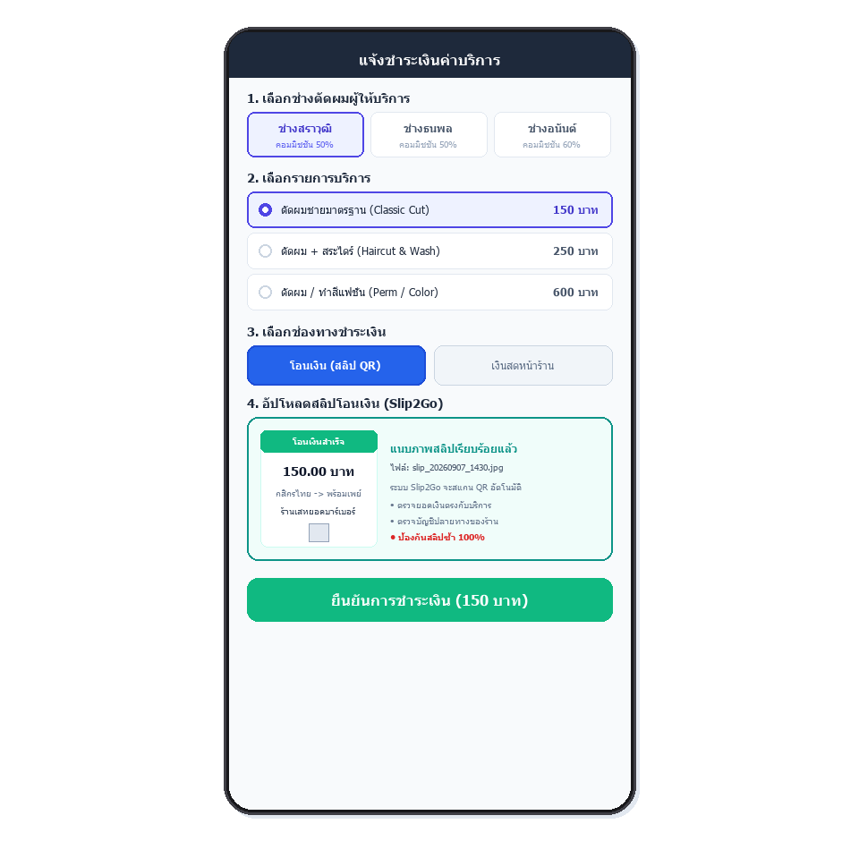

**ภาพที่ 3.12** หน้าจอแจ้งชำระเงินผ่านการโอนเงินและแนบสลิป (LIFF Transfer Payment Form)  
**ที่มา:** โดยผู้จัดทำโครงงาน  

#### 3.3.3.3 ผลการทำงานที่ได้จากการออกแบบหน้าจอแจ้งชำระเงินสดหน้าร้าน (LIFF - Cash Method)
เมื่อลูกค้าเลือกช่องทาง "เงินสดหน้าร้าน" หน้าจอจะแสดงกล่องแจ้งเตือนสีส้มเพื่อย้ำให้ชำระเงินสดแก่ช่าง พร้อมแสดงยอดเงินและส่วนแบ่งค่าคอมมิชชันที่คำนวณแบบ 50:50 ให้เห็นทันที ดังภาพที่ 3.13

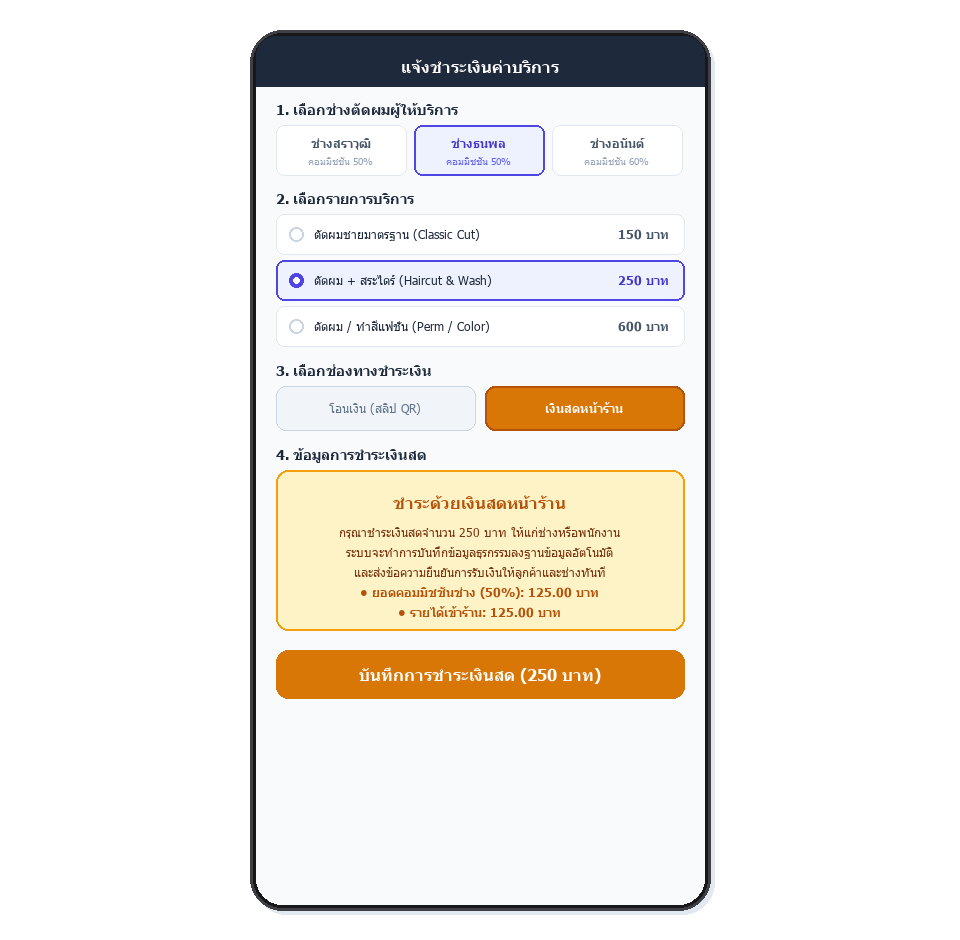

**ภาพที่ 3.13** หน้าจอแจ้งชำระเงินสดหน้าร้าน (LIFF Cash Payment Form)  
**ที่มา:** โดยผู้จัดทำโครงงาน  

#### 3.3.3.4 ผลการทำงานที่ได้จากการออกแบบใบเสร็จรับเงินอิเล็กทรอนิกส์ (LINE Flex Message e-Receipt)
ใบเสร็จอิเล็กทรอนิกส์ส่งตอบกลับอัตโนมัติไปยังลูกค้าในห้องแชทไลน์ทันทีหลังการชำระเงินสำเร็จ ระบุรหัสธุรกรรมจริง (TXN-39) ชื่อช่าง รายการบริการ ยอดเงิน และตราสัญลักษณ์ Slip2Go Verified ดังภาพที่ 3.14

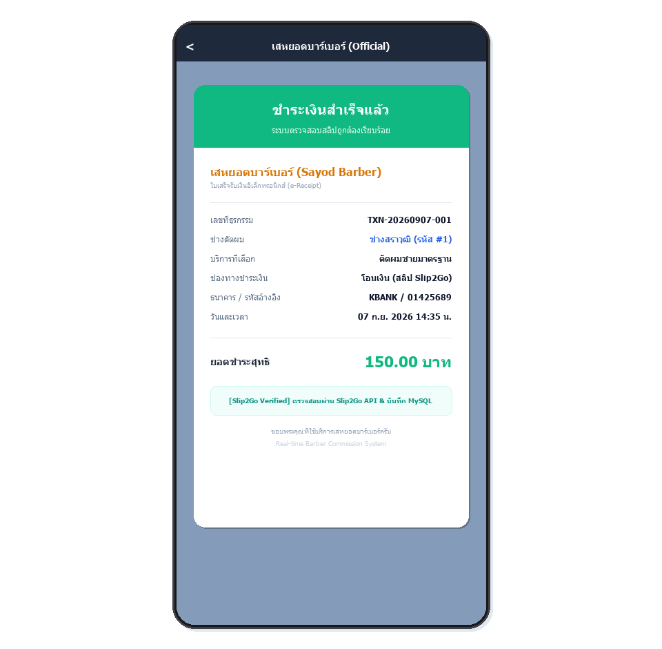

**ภาพที่ 3.14** การออกแบบใบเสร็จรับเงินอิเล็กทรอนิกส์ (LINE Flex Message e-Receipt)  
**ที่มา:** โดยผู้จัดทำโครงงาน  

#### 3.3.3.5 ผลการทำงานที่ได้จากการออกแบบใบแจ้งยอดเคลียร์เงินช่าง (LINE Flex Message Barber Payout Voucher)
ข้อความแจ้งเตือนพร้อมหลักฐานการโอนเงินเคลียร์ยอดตัดรอบ ส่งตรงไปยังไลน์ของช่างตัดผม ระบุจำนวนงาน ยอดเงินสุทธิ และรูปสลิปหลักฐานการโอนของเจ้าของร้าน ดังภาพที่ 3.15

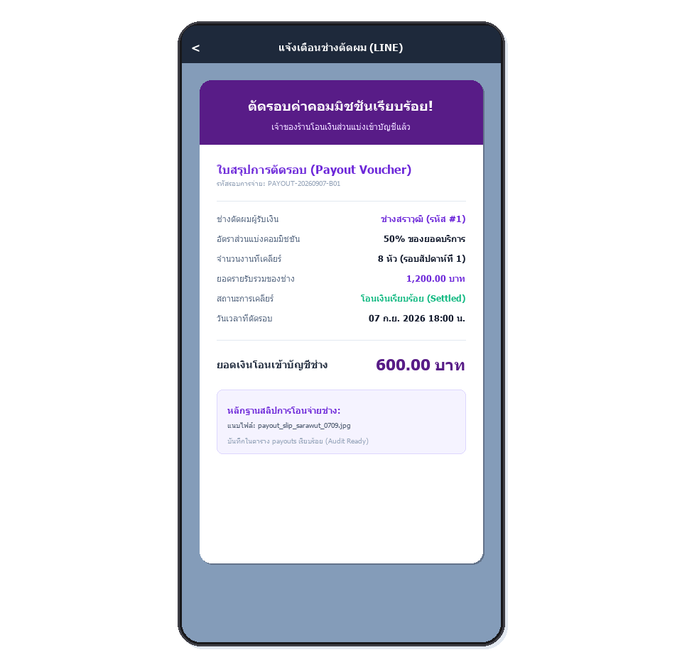

**ภาพที่ 3.15** การออกแบบใบแจ้งยอดเคลียร์เงินช่าง (LINE Flex Message Barber Payout Voucher)  
**ที่มา:** โดยผู้จัดทำโครงงาน  

#### 3.3.3.6 ผลการทำงานที่ได้จากการออกแบบการแจ้งเตือนโมฆะบิล (LINE Flex Message Void Bill Alert)
ข้อความแจ้งเตือนสีแดงส่งตรงถึงช่างตัดผมเมื่อบิลถูกยกเลิก พร้อมระบุยอดค่าคอมมิชชันที่ถูกหักลบและเหตุผลการยกเลิก เพื่อความโปร่งใส ดังภาพที่ 3.16

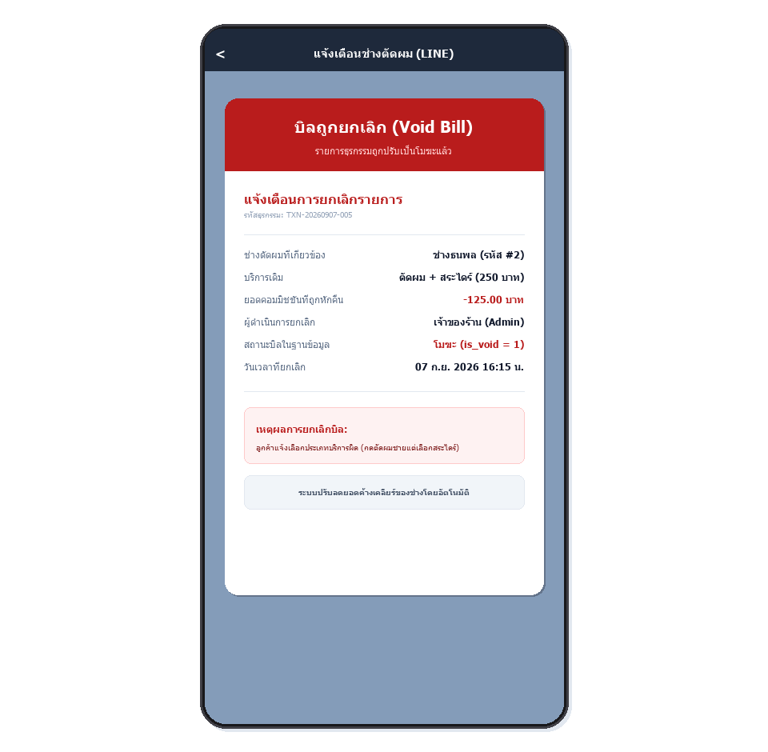

**ภาพที่ 3.16** การออกแบบการแจ้งเตือนโมฆะบิล (LINE Flex Message Void Bill Alert)  
**ที่มา:** โดยผู้จัดทำโครงงาน  

#### 3.3.3.7 ผลการทำงานที่ได้จากการออกแบบหน้าระบบจัดการข้อมูลช่างตัดผม (Admin Backoffice - Barbers Management)
หน้าเว็บจัดการข้อมูลช่างตัดผม รองรับการเพิ่ม ลบ แก้ไข อัตราส่วนแบ่งค่าคอมมิชชัน และสลับสถานะเปิด/ปิดการทำงานของช่าง ดังภาพที่ 3.17

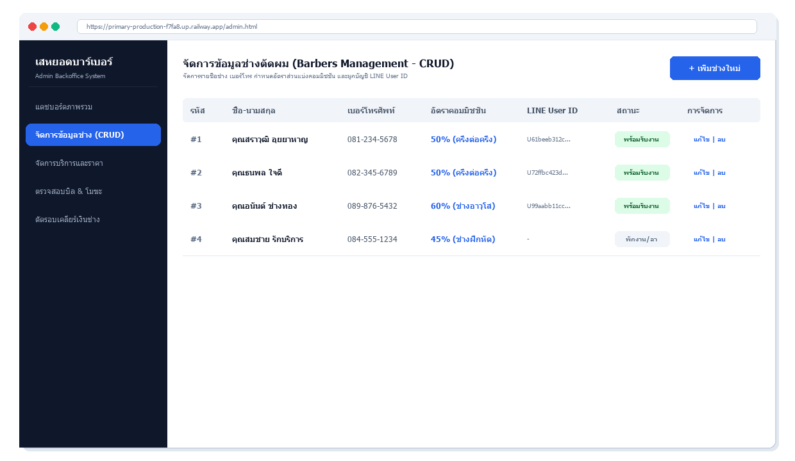

**ภาพที่ 3.17** หน้าเว็บจัดการข้อมูลช่างตัดผม (Admin Backoffice - Barbers CRUD)  
**ที่มา:** โดยผู้จัดทำโครงงาน  

#### 3.3.3.8 ผลการทำงานที่ได้จากการออกแบบหน้าระบบจัดการรายการบริการและราคา (Admin Backoffice - Services Management)
หน้าเว็บจัดการรายการบริการตัดผม สระ เซ็ตผม พร้อมกำหนดราคามาตรฐานและระยะเวลาให้บริการ ดังภาพที่ 3.18

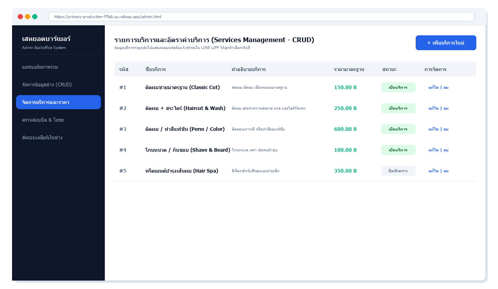

**ภาพที่ 3.18** หน้าเว็บจัดการรายการบริการและราคา (Admin Backoffice - Services CRUD)  
**ที่มา:** โดยผู้จัดทำโครงงาน  

#### 3.3.3.9 ผลการทำงานที่ได้จากการออกแบบหน้าระบบตรวจสอบประวัติธุรกรรมและโมฆะบิล (Admin Backoffice - Transactions & Void Bill)
หน้าเว็บแสดงรายการบิลรายได้ทั้งหมด แยกสถานะเงินสด เงินโอน และมีปุ่มสำหรับดำเนินการโมฆะบิล ดังภาพที่ 3.19

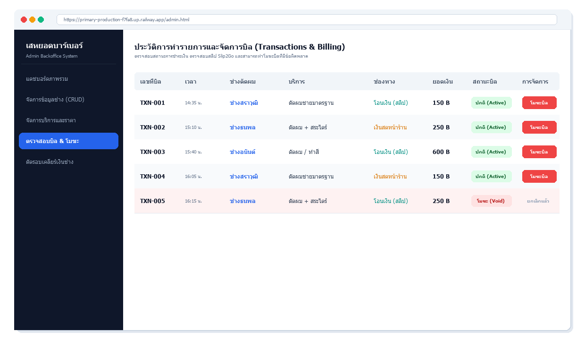

**ภาพที่ 3.19** หน้าเว็บตรวจสอบประวัติธุรกรรมและโมฆะบิล (Admin Backoffice - Transactions & Void Action)  
**ที่มา:** โดยผู้จัดทำโครงงาน  

#### 3.3.3.10 ผลการทำงานที่ได้จากการออกแบบกล่องข้อความยืนยันการทำโมฆะบิล (SweetAlert2 Void Confirmation Modal)
หน้าต่างป๊อปอัปแจ้งเตือนให้เจ้าของร้านระบุเหตุผลในการยกเลิกบิลก่อนทำการยืนยัน เพื่อเก็บเป็นประวัติ Audit Log ดังภาพที่ 3.20

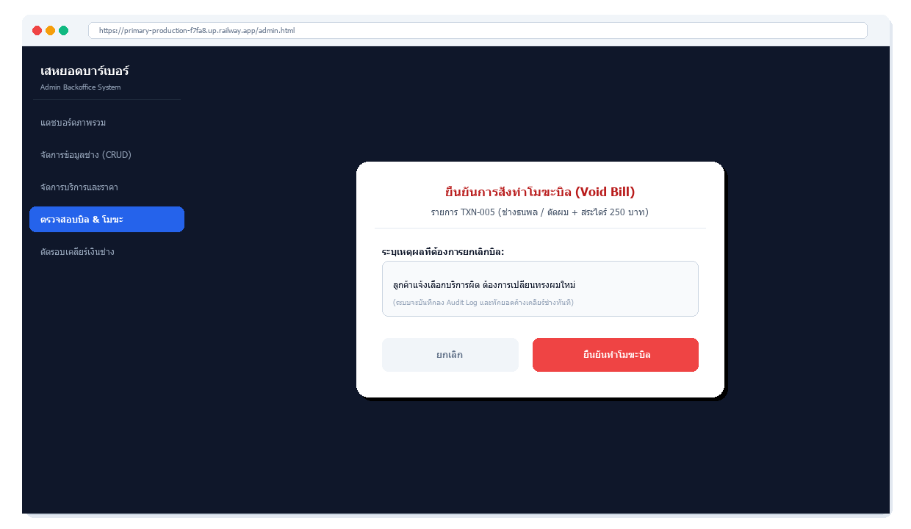

**ภาพที่ 3.20** กล่องข้อความยืนยันการทำโมฆะบิล (Void Bill Confirmation Modal Popup)  
**ที่มา:** โดยผู้จัดทำโครงงาน  

#### 3.3.3.11 ผลการทำงานที่ได้จากการออกแบบหน้าระบบตัดรอบเคลียร์เงินช่าง (Admin Backoffice - Barber Settlements)
หน้าเว็บแสดงการ์ดยอดค้างเคลียร์ (Unsettled) แยกรายช่าง พร้อมปุ่มกดดำเนินการตัดรอบเคลียร์เงิน และตารางประวัติการตัดรอบในอดีต ดังภาพที่ 3.21

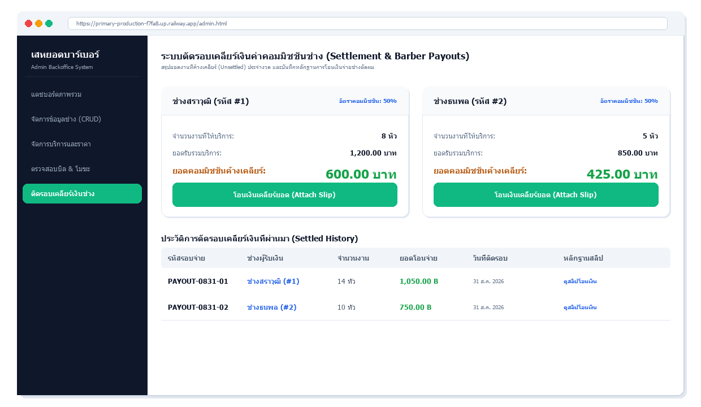

**ภาพที่ 3.21** หน้าเว็บตัดรอบเคลียร์เงินช่าง (Admin Backoffice - Barber Settlements & Unsettled Cards)  
**ที่มา:** โดยผู้จัดทำโครงงาน  

#### 3.3.3.12 ผลการทำงานที่ได้จากการออกแบบหน้าต่างยืนยันการโอนเงินเคลียร์ยอด (Settlement Confirmation Modal)
หน้าต่างป๊อปอัปให้เจ้าของร้านแนบสลิปหลักฐานการโอนเงินให้ช่าง และกดยืนยันตัดรอบเพื่อแจ้งเตือนไปยัง LINE ของช่าง ดังภาพที่ 3.22

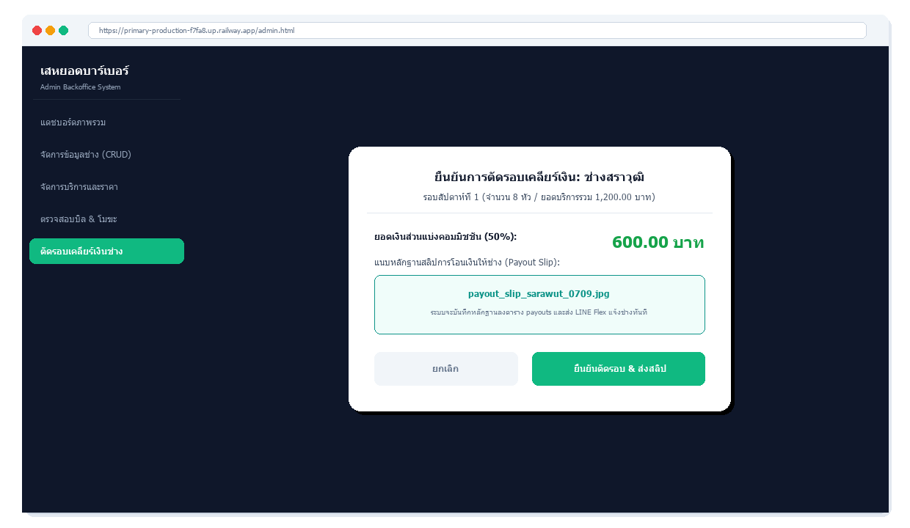

**ภาพที่ 3.22** หน้าต่างยืนยันการโอนเงินเคลียร์ยอดและแนบสลิป (Settlement Confirmation Modal)  
**ที่มา:** โดยผู้จัดทำโครงงาน  

#### 3.3.3.13 ผลการทำงานที่ได้จากการออกแบบหน้าจอแดชบอร์ดสรุปผลทางการเงิน (Google Looker Studio Analytics)
หน้าจอแดชบอร์ดสรุปสถิติผลประกอบการ แสดงยอดขายรวม สัดส่วนบริการยอดนิยม รายได้แยกตามช่าง และแนวโน้มรายรับแบบเรียลไทม์ ดังภาพที่ 3.23

.png)

**ภาพที่ 3.23** การออกแบบแดชบอร์ดสรุปผลทางการเงิน (Google Looker Studio Business Intelligence)  
**ที่มา:** โดยผู้จัดทำโครงงาน  

## 3.4 การพัฒนาระบบ
ในการศึกษาและพัฒนาระบบบันทึกรายได้และคำนวณค่าคอมมิชชันช่างตัดผมแบบเรียลไทม์ผ่านแอปพลิเคชันไลน์นั้น ผู้พัฒนาระบบได้มีการออกแบบขั้นตอนการพัฒนาระบบ ดังต่อไปนี้:

### 3.4.1 ศึกษาข้อมูลเอกสารจากการสัมภาษณ์ การสอบถาม และสังเกตการทำงานของบุคคลที่เกี่ยวข้องกับระบบงาน
ผู้พัฒนาระบบได้ทำการเก็บรวบรวมข้อมูลจากการสัมภาษณ์และสอบถามเจ้าของร้านตัดผม ช่างตัดผม และลูกค้าผู้ใช้บริการ รวมถึงการสังเกตกระบวนการทำงานจริงภายในร้าน เช่น ขั้นตอนการรับชำระเงิน การตรวจสอบความถูกต้องของสลิปโอนเงินผ่านแอปพลิเคชันธนาคาร และการจดบันทึกคำนวณส่วนแบ่งรายได้ค่าคอมมิชชันลงในสมุดบัญชี เพื่อทำความเข้าใจถึงปัญหาและข้อจำกัดของระบบงานเดิมอย่างละเอียด

### 3.4.2 นำข้อมูลที่ได้มาทำการกำหนดความต้องการของระบบ
นำข้อมูลปัญหาและความต้องการที่ได้จากการสำรวจมากำหนดเป็นความต้องการของระบบ (System Requirements) โดยแบ่งออกเป็น ความต้องการด้านการทำงานของระบบ (Functional Requirements) เช่น การตรวจสอบความถูกต้องของสลิปโอนเงินอัตโนมัติ การส่งใบเสร็จรับเงินอิเล็กทรอนิกส์ (e-Receipt) การตัดรอบเคลียร์เงินช่าง และการแสดงผลรายงานสรุปยอดขายบนแดชบอร์ด รวมถึงความต้องการด้านที่ไม่ใช่ฟังก์ชัน (Non-Functional Requirements) เช่น ความรวดเร็วในการประมวลผล ความถูกต้องแม่นยำของข้อมูล และความปลอดภัยในการจัดเก็บข้อมูล

### 3.4.3 วิเคราะห์ระบบ
การวิเคราะห์ระบบมาจากการศึกษาระบบเดิมและความต้องการของผู้ใช้งาน จากการที่ต้องตรวจสอบสลิปโอนเงินด้วยตนเอง และการคำนวณส่วนแบ่งตัดรอบเคลียร์เงินช่างด้วยมือ ซึ่งอาจเกิดความล่าช้า ข้อมูลตกหล่น และปัญหาการใช้สลิปปลอม ซึ่งเป็นปัญหาหลักที่เกิดขึ้นในระบบงานเดิม

### 3.4.4 ออกแบบระบบ
การออกแบบระบบเริ่มจากการออกแบบส่วนผู้ใช้ติดต่อหน้า ประกอบด้วย ริชเมนู (Rich Menu) 3 ตัวเลือกสำหรับลูกค้าและช่าง, หน้าเว็บลิฟต์ (LIFF) สำหรับแจ้งชำระเงิน, หน้าเว็บแอดมินจัดการหลังบ้านแบบ CRUD สำหรับเจ้าของร้านในการจัดการช่าง บริการ บิล และการตัดรอบเคลียร์ยอดเงิน รวมถึงการออกแบบสถาปัตยกรรมระบบ แผนภาพลำดับขั้นตอน และโครงสร้างฐานข้อมูล 4 ตารางหลัก

### 3.4.5 พัฒนาระบบ
ในการพัฒนาระบบ ผู้จัดทำได้แบ่งออกเป็น 2 หัวข้อดังนี้:
#### 3.4.5.1 การพัฒนาจากระบบเอ็นเอทเอ็น
ที่จะช่วยในการทำงานแบบอัตโนมัติ เมื่อผู้ใช้งานป้อนการแจ้งชำระเงินเข้ามา การส่งรูปสลิปไปตรวจสอบกับสลิปทูโกเอพีไอ การส่งข้อความแจ้งเตือนผ่านไลน์เมสเสจจิ้งเอพีไอ ตลอดจนการประมวลผลเวิร์กโฟลว์การตัดรอบเคลียร์เงินช่าง
#### 3.4.5.2 การพัฒนาจากระบบฐานข้อมูลจากมายเอสคิวแอล
ซึ่งจะช่วยในการเก็บข้อมูลอย่างเป็นระบบ ประกอบด้วย 4 ตารางหลัก ได้แก่ ข้อมูลผู้ใช้งานและช่างตัดผม (users), ข้อมูลบริการ (services), ธุรกรรมรายรับ (transactions), และรอบการเคลียร์เงินช่าง (payouts)

### 3.4.6 ทดสอบระบบ ด้วยการติดตั้งและทดสอบใช้งานจริง เพื่อให้ทราบถึงข้อผิดพลาดต่างๆ ที่อาจเกิดขึ้นของระบบ เพื่อเพิ่มความมั่นใจและความน่าเชื่อถือของระบบ
ทำการทดสอบการทำงานของระบบทั้งกรณีการชำระเงินด้วยสลิปจริงและสลิปปลอม, การคำนวณและตัดรอบเคลียร์เงินช่าง, และการแสดงผลสรุปยอดขายบนแดชบอร์ด เพื่อให้มั่นใจว่าระบบทำงานได้อย่างถูกต้อง แม่นยำ และมีเสถียรภาพ

### 3.4.7 สรุปการประเมินผลการทดสอบ
รวบรวมผลการทดสอบและข้อบกพร่องที่พบ นำมาปรับปรุงแก้ไขการทำงานของระบบให้มีความสมบูรณ์ และประเมินความพึงพอใจของผู้ใช้งานกลุ่มตัวอย่าง

### 3.4.8 จัดทำเอกสารคู่มือการใช้งาน
จัดทำเอกสารคู่มือการใช้งานระบบสำหรับผู้ใช้งานแต่ละกลุ่ม ได้แก่ ลูกค้า ช่างตัดผม และเจ้าของร้าน เพื่อให้สามารถใช้งานระบบได้อย่างถูกต้องและเกิดประโยชน์สูงสุด
